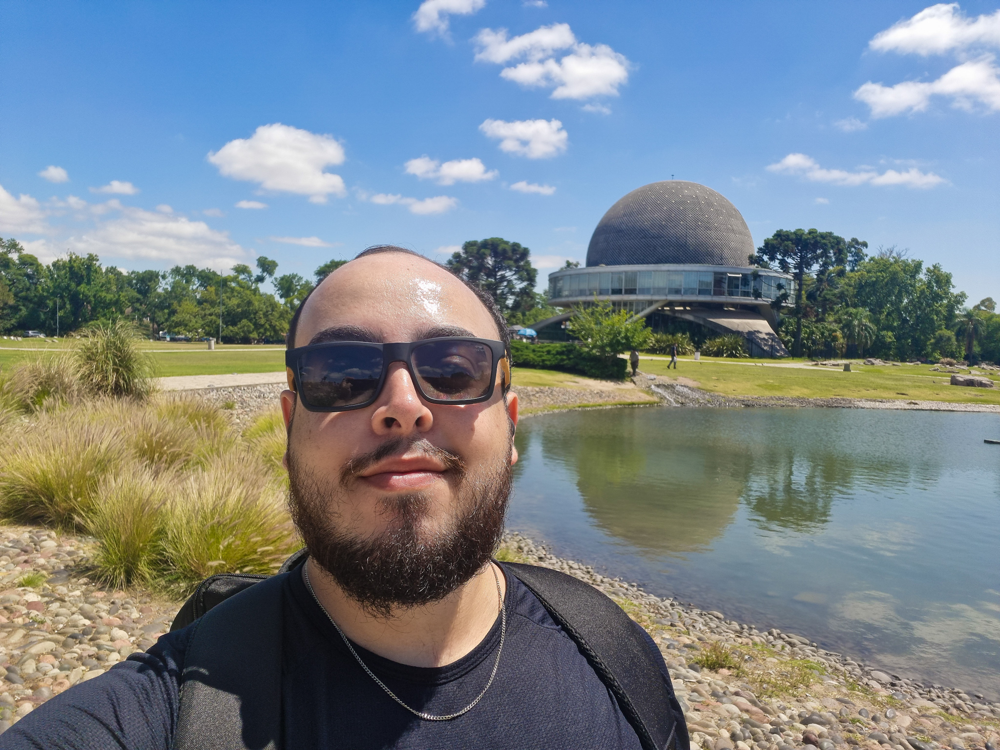

---
# the default layout is 'page'
icon: fas fa-info-circle
order: 4
---

Desenvolvedor Backend e estudante de Física. Criei esse blog com o intuito de guardar em algum lugar minhas reflexões e estudos de forma bem informal, sem tanta formalidade igual se vê em livros ou em aulas.

## 💻 Desenvolvimento de Software

Atualmente trabalho como Desenvolvedor Backend na BEES Brasil, parte da AB-InBev. Minhas principais tecnologias (não somente as que uso no trabalho) incluem:

- **Linguagens**: Java, Kotlin, Go, Python
- **Frameworks**: Spring Framework
- **Bancos de Dados**: 
  - SQL: PostgreSQL, MySQL
  - NoSQL: MongoDB, DynamoDB

## 🔬 Física

Como estudante de Física, tenho especial interesse em:
- Física Computacional aplicada em Fenomenologia de Partículas (simulações Monte Carlo, por exemplo)
- Física Teórica
    - Física do Modelo Padrão e Partículas Elementares
    - Teoria de Grupos

## 🛠️ Projetos Interessantes

Alguns dos meus projetos que eu tenho bastante carinho e não estão diretamente ligados ao que faço no trabalho:

1. **[Game of Life](https://github.com/franciscofeo/GameOfLife)** (Python)
   - Implementação do famoso autômato celular de John Conway
   - Demonstração prática de sistemas complexos e emergência

2. **[Gryphon CLI](https://github.com/franciscofeo/gryphon-cli)** (Go)
   - Ferramenta CLI para automação de tarefas em desenvolvimento web
   - Foco em produtividade e eficiência

## 📚 Interesses e Hobbies

Como hobby, gosto de aprender/explorar:
- Infraestrutura e aprender sobre a cultura DevOps
- Física Atmosférica
- Estudar música, principalmente análises de harmonia

Acredito que a combinação de ciência e tecnologia pode nos levar a soluções mais elegantes e eficientes. Meu objetivo é continuar explorando essa intersecção, contribuindo tanto para o mundo do desenvolvimento de software quanto para a compreensão de fenômenos físicos através da computação.

## 📫 Contato

Você pode me encontrar em:
- [GitHub](https://github.com/franciscofeo)
- [LinkedIn](https://www.linkedin.com/in/francisco-angelo/)
